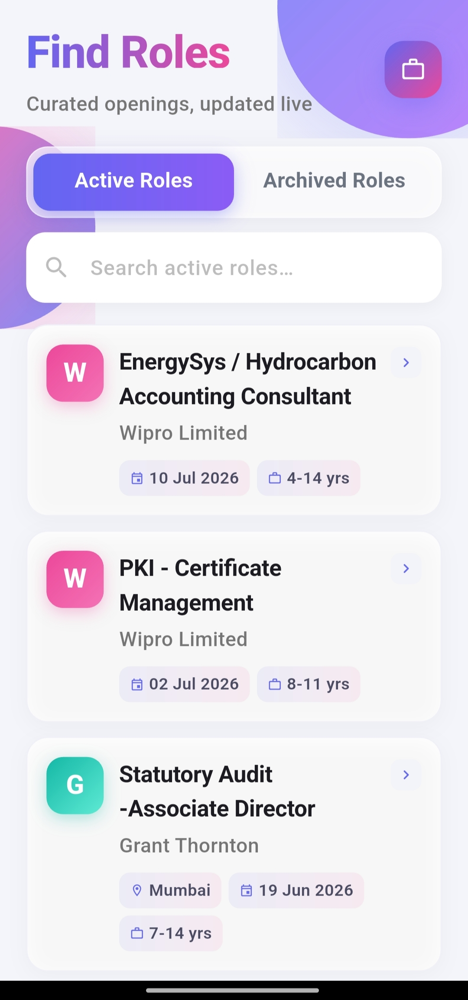
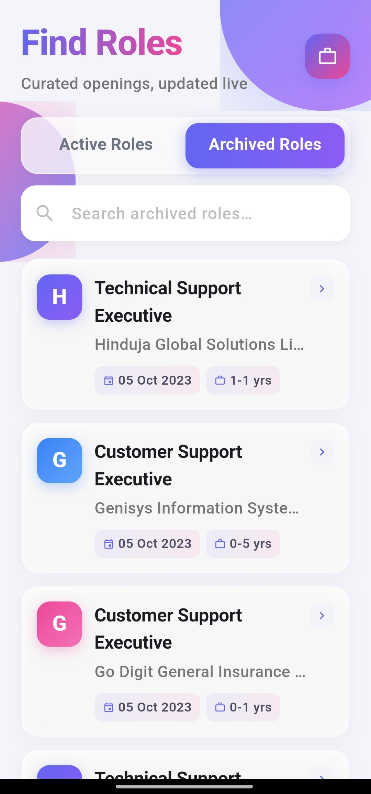
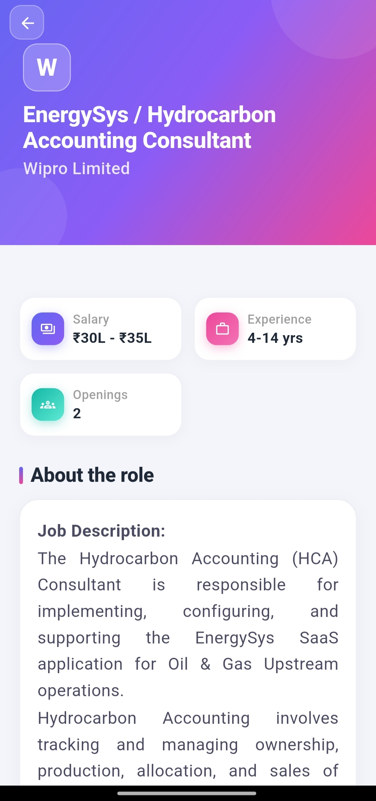
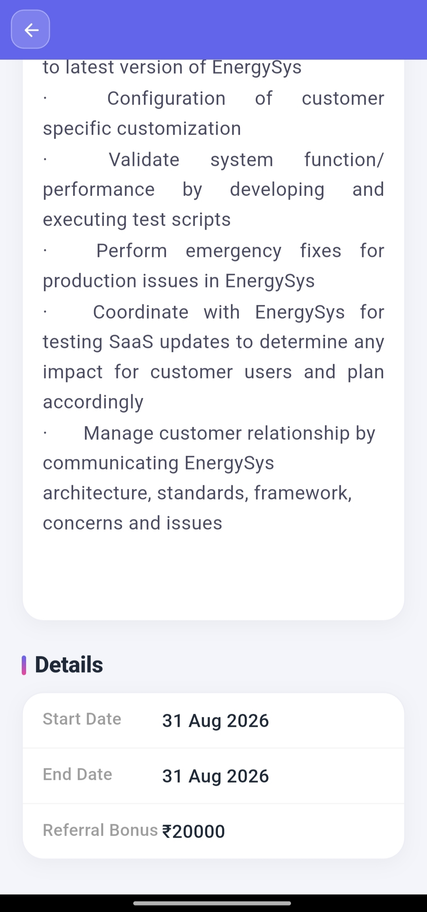

# Job Listing App

A Flutter application that fetches and displays job roles from a live REST API, organized into **Active Roles** and **Archived Roles** tabs, with local search and a detailed job view. Built as an internship assessment task for 91 Technologies Private Limited.

## Overview

The app consumes two GET endpoints to display job listings, allows users to search through the fetched results locally without additional network calls, and provides a dedicated details screen for each role with all available information from the API response.

## Features

- **Tab Navigation** — Separate tabs for Active and Archived roles.
- **Live Data Fetching** — Each tab independently fetches its data on load from the respective API endpoint.
- **List/Card View** — Each job entry displays the job title, company name, posted/archived date, and other key details at a glance.
- **State Handling** — Dedicated UI states for loading, empty results, and error/failure scenarios, each with a retry/refresh action.
- **Local Search** — Instant, in-memory filtering by job title and company name (case-insensitive, partial match) with no additional API calls per keystroke.
- **Pull to Refresh** — Manual refresh support on each tab.
- **Job Details Screen** — Displays all available fields for a selected role in a clean, readable layout, with state and scroll position preserved on the list when navigating back.

## Tech Stack

- **Flutter** (Dart)
- **Provider** — State management
- **http** — Networking
- **intl** — Date and currency formatting

## API Endpoints

Both endpoints are GET requests and require no authentication.

| Purpose | Endpoint |
|---|---|
| Active Roles | `https://api.wraeglobal.com/roleRouter/getActiveRoles` |
| Archived Roles | `https://api.wraeglobal.com/roleRouter/getArchivedRoles` |

## Project Structure

```
lib/
├── models/
│   └── job_model.dart          # Job entity and JSON parsing
├── providers/
│   └── job_provider.dart       # State management for Active and Archived roles
├── screens/
│   ├── home_screen.dart        # Tab container
│   ├── job_list_tab.dart       # List, search, and state rendering per tab
│   └── job_detail_screen.dart  # Full job details view
├── services/
│   └── api_service.dart        # API calls and response handling
├── widgets/
│   ├── job_card.dart           # List item widget
│   ├── search_bar_widget.dart  # Search input widget
│   └── state_views.dart        # Loading / empty / error views
└── main.dart                   # App entry point and provider setup
```

## Architecture Notes

- `ApiService` is responsible only for fetching and decoding data from the network; it does not hold any state.
- `JobProvider` holds the fetched list, the active search query, and the current view state (idle, loading, loaded, empty, error). It is subclassed into `ActiveJobProvider` and `ArchivedJobProvider` so that both tabs can be registered independently in the widget tree without colliding as the same provider type.
- Search filtering happens entirely in-memory against the already-fetched list; no network request is triggered while typing.
- The API occasionally returns HTML content in the job description field with inconsistent escaping. This is normalized in the model layer before being rendered, so the details screen always shows clean, readable text.

## Getting Started

### Prerequisites

- Flutter SDK installed (stable channel)
- An emulator, simulator, or physical device connected

### Installation

```bash
git clone <repository-url>
cd <repository-folder>
flutter pub get
```

### Running the App

```bash
flutter run
```

## Screenshots

| Home Screen | Archived Roles | Job Details | Job Details |
|---|---|---|---|
|  |  |  |  |

## Submission

- GitHub repository: [GitHub](https://github.com/shikhar11x/flutter-JobListingApp)
- Demo video: [DEMO VIDEO](https://drive.google.com/file/d/1NiVFASvnydTnvGiYtF0kFWfEibAyxmR2/view?usp=sharing)
- APK- [APK](https://github.com/shikhar11x/flutter-JobListingApp/releases/tag/v-0.1)

## Author

Submitted as part of the Flutter internship assessment task for 91 Technologies Private Limited.
